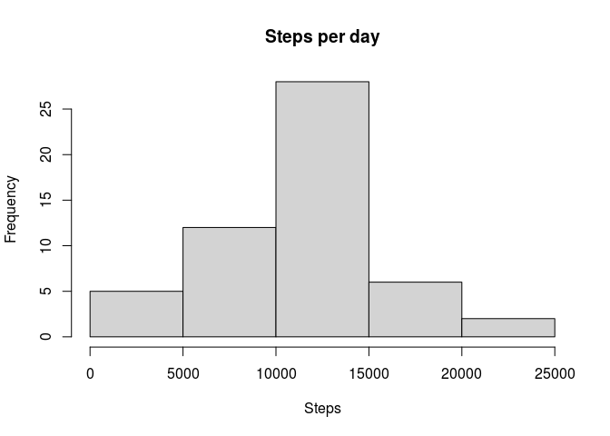
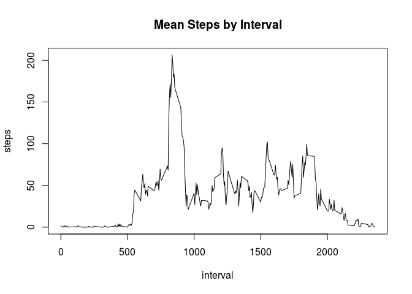
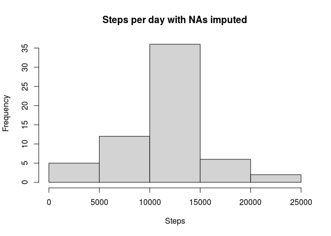
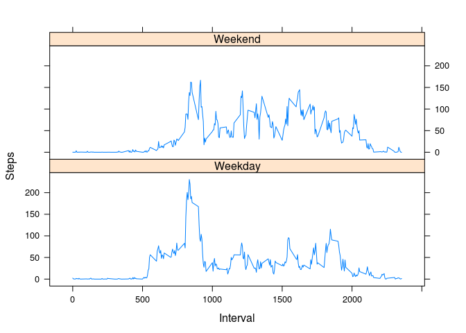

## Loading and preprocessing the data
First we need to load the data. We do this by unzipping and loading the data.
I also change the date column from "chr" type to "date" type.


```r
data <- read.csv(unz("activity.zip","activity.csv"))
data$date <- as.Date(data$date, "%Y-%m-%d")
```

## What is mean total number of steps taken per day?
First we need to find the total number of steps taken per day.


```r
date_steps <- aggregate(data$steps ~ data$date, FUN = sum)
colnames(date_steps) <- c("date","steps")
```

Then we can do a histogram


```r
hist(date_steps$steps, xlab= "Steps", main = "Steps per day")
```

<!-- -->

Then we can find the mean total steps using the 'mean' function and the median
using the 'median' function


```r
mean(date_steps$steps)
```

```
## [1] 10766.19
```

```r
median(date_steps$steps)
```

```
## [1] 10765
```

## What is the average daily activity pattern?
First we need to find the mean number of steps per interval by using the
aggregate function. Then we can plot the result using the 'plot' function. 


```r
int_steps <- aggregate(data$steps ~ data$interval, FUN = mean)
colnames(int_steps) <- c("interval", "steps")

plot(int_steps$interval,int_steps$steps,type = "l", xlab = "interval", ylab = "steps", main = "Mean Steps by Interval")
```

<!-- -->

The maximum value and its corresponding interval is found using a combination of the maximum function and grepl from our new dataset 


```r
int_steps[grepl(max(int_steps$steps),int_steps$steps),]
```

```
##     interval    steps
## 104      835 206.1698
```

From this we see that the maximum steps in this dataset is 206.17 at the 835th interval, on average. 

## Imputing missing values
The number of NA values can be found using is.na which returns a logical vector. We will save this vector so we can use it later, but we will sum it to understand our total number of NA values.  


```r
na_vec <- is.na(data$steps)
sum(na_vec)
```

```
## [1] 2304
```

For this exercise, we are going to make an identical data dataset and replace all of the NA values with the mean value at that particular interval over the whole dataset, as we calculated above. We'll accomplish this task using a for loop. 


```r
data_rmNA <- data
for (i in 1:length(data_rmNA$steps)) {
    if(is.na(data_rmNA$steps[i])) {
        data_rmNA$steps[i]<-int_steps$steps[match(data_rmNA$interval[i],
                                                  int_steps$interval)]
    }
}
```

Now we can look at a histogram of the new dataset, as well as the mean and median, and compare it to the original. We'll aggregate the data like we did before.


```r
date_steps_rmNA <- aggregate(data_rmNA$steps ~ data_rmNA$date, FUN = sum)
colnames(date_steps_rmNA) <- c("date","steps")
hist(date_steps_rmNA$steps, xlab = "Steps", 
     main = "Steps per day with NAs imputed")
```

<!-- -->

The mean can be compared here:

```r
mean(date_steps_rmNA$steps)
```

```
## [1] 10766.19
```

```r
mean(date_steps$steps)
```

```
## [1] 10766.19
```

And similarly the median here:

```r
median(date_steps_rmNA$steps)
```

```
## [1] 10766.19
```

```r
median(date_steps$steps)
```

```
## [1] 10765
```

From this we see that the mean hasn't really changed, but the median changed slightly. In general, the NA values don't really affect the data and do not need to be substituted. 


## Are there differences in activity patterns between weekdays and weekends?

We'll need to employ the use of weekdays() function for this task. First look at what days are weekends, and then we'll column-bind that data back into the original data set and make sure it is listed as a factor. 


```r
days <- weekdays(data_rmNA$date)
days_factor <- ifelse(days == "Saturday" | days == "Sunday", "Weekend", "Weekday")

data_rmNA <- cbind(data_rmNA,days_factor)
data_rmNA$days_factor <- as.factor(data_rmNA$days_factor)
```

Now that we have our factored data, we can make a panel plot to examine whether weekend activity is different from weekday activity. We will have to aggregate the information, as we did in the previous problems, over the mean of steps by interval. 

Then we use a lattice plot to display the data.


```r
library(lattice)
weekend_int <- 
  aggregate(data_rmNA$steps ~ data_rmNA$days_factor + data_rmNA$interval, 
            FUN = mean)
colnames(weekend_int) <- c("days_factor","interval","steps")
xyplot(weekend_int$steps~weekend_int$interval|weekend_int$days_factor,type="l",layout=c(1,2),xlab="Interval",ylab="Steps",title="Mean number of steps by interval based on day type")
```

<!-- -->

From the data, we can see there is a significant difference in activity levels from weekdays to weekends.
